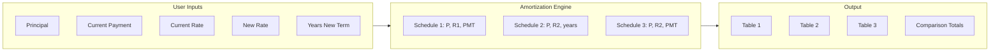

# Refinance Comparison Web Application

## Scope

**User inputs (4 required):**

- Remaining loan balance (principal)
- Current monthly payment
- Current interest rate (annual %)
- Interest rate after refinance (annual %)
- **Loan term after refinance**
- **Refinance cost. Default to 0.**

---

## Three Amortization Schedules


| Schedule                              | Description                       | Inputs                                           | Output                                                    |
| ------------------------------------- | --------------------------------- | ------------------------------------------------ | --------------------------------------------------------- |
| **1. Before refinance**               | Current loan as-is                | principal, current rate, current monthly payment | Months to payoff, schedule, total payment, total interest |
| **2. After refinance (new term)**     | New loan with chosen term         | principal, new rate, **years**                   | Monthly payment, schedule, total payment, total interest  |
| **3. After refinance (same payment)** | New rate but keep current payment | principal, new rate, current monthly payment     | Months to payoff, schedule, total payment, total interest |


**Shared math:**

- Monthly rate `r = annual_rate / 1200`.
- For each month: `interest = balance * r`; `principal_paid = payment - interest`; `balance -= principal_paid`. Repeat until balance ≤ 0.
- **Payment from term (Schedule 2):** `payment = P * r * (1+r)^n / ((1+r)^n - 1)` with `n = years * 12`.

---

## Tech Stack (recommendation)

- **Vanilla HTML + CSS + JavaScript** in a single folder: no build step, runs in any browser, easy to open as `index.html` or serve with any static server.
- **Alternative:** Small React/Vite or Vue app if you want components and future scaling; the plan below stays valid, only the file structure would follow a React/Vue template.

---

## Architecture




---

## File Structure

```
CursorDemo/
├── index.html          # Single page: form + 3 schedule sections + comparison summary
├── styles.css          # Layout, table styling, responsive
└── app.js              # Input handling, 3 amortization functions, DOM updates
```

---

## Implementation Details

### 1. `index.html`

- Form with number inputs: remaining balance, current monthly payment, current rate (%), refinance rate (%), loan term after refinance (years).
- Placeholders for:
  - Three “schedule” areas (each: table with columns Month, Payment, Principal, Interest, Balance).
  - One comparison block: for each scenario, show **Total payment** and **Total interest** (and optionally months to payoff where applicable).
- No external dependencies; script and styles linked locally.

### 2. `app.js`

- `**amortizeWithPayment(principal, annualRate, monthlyPayment)`**  
Used for Schedule 1 and 3. Loop month-by-month until balance ≤ 0. Return `{ schedule: [...], totalPayment, totalInterest, months }`.
- `**paymentFromTerm(principal, annualRate, years)`**  
Return monthly payment for Schedule 2 using the standard formula.
- `**amortizeWithTerm(principal, annualRate, years)`**  
Compute payment via `paymentFromTerm`, then run same month-by-month loop. Return same shape as above.
- **Event handler** on form submit (or “Calculate” button): read inputs, validate (positive numbers, sensible rates). Call the three paths, then render:
  - Three schedule tables (e.g. first 12 months + “…” + last 12 months if long, or full scrollable table for shorter terms).
  - Comparison section: total payment and total interest for each of the 3 scenarios side-by-side (e.g. table or cards).

### 3. `styles.css`

- Simple, readable layout: form on top, then three schedule sections, then comparison.
- Tables: clear headers, alternating row background for readability.
- Responsive: tables scroll horizontally on small screens if needed.

---

## Validation and Edge Cases

- Ensure principal > 0, payments > 0, rates ≥ 0.
- For “payoff” schedules (1 and 3): if monthly payment ≤ monthly interest (e.g. rate too high or payment too low), loan never pays off — show a clear error message instead of infinite loop.
- Round currency to 2 decimals for display; keep raw numbers for internal math to avoid drift.

---

## Enhancements

- Simple chart (e.g. total interest or balance over time for the three scenarios).
- “Break-even” note: e.g. if refinance has closing costs, how many months of savings to break even (could be a later phase).

---

## Summary

- One page, 4–5 inputs (including “years” for the new term).
- Three amortization flows implemented in JS; two use fixed payment (schedules 1 and 3), one uses fixed term (schedule 2).
- Output: three amortization tables plus a comparison of total payment and total interest so the homeowner can decide whether to refinance.

